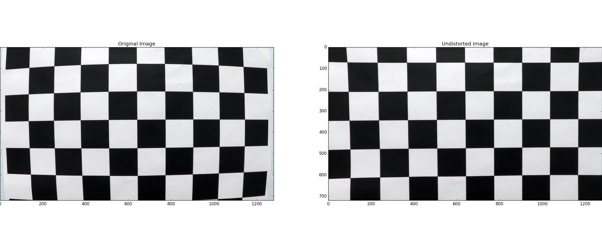
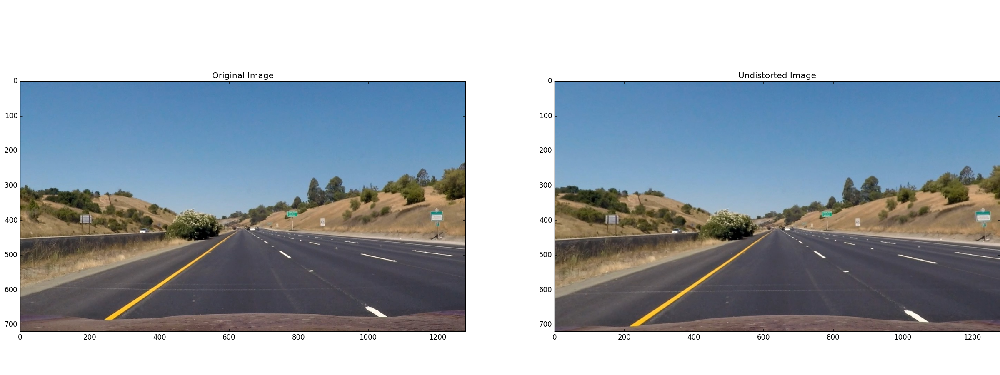
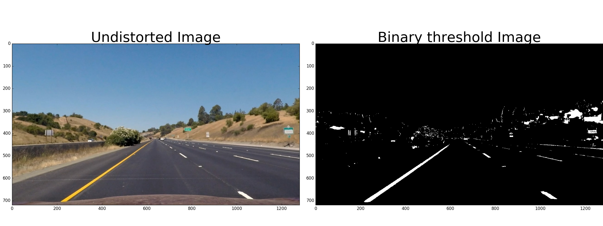
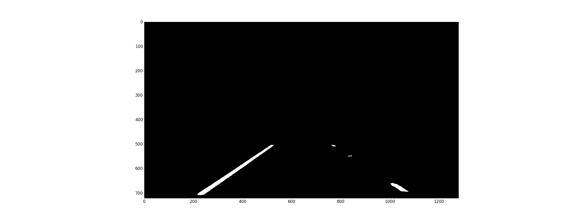
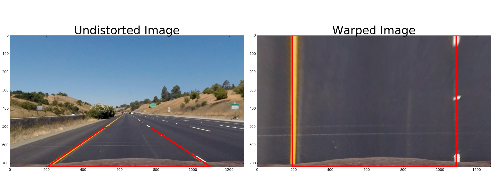
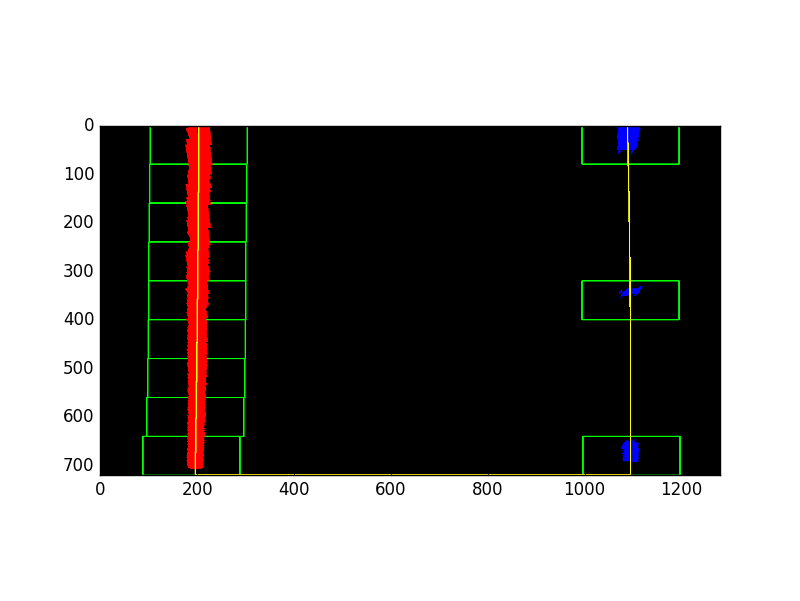
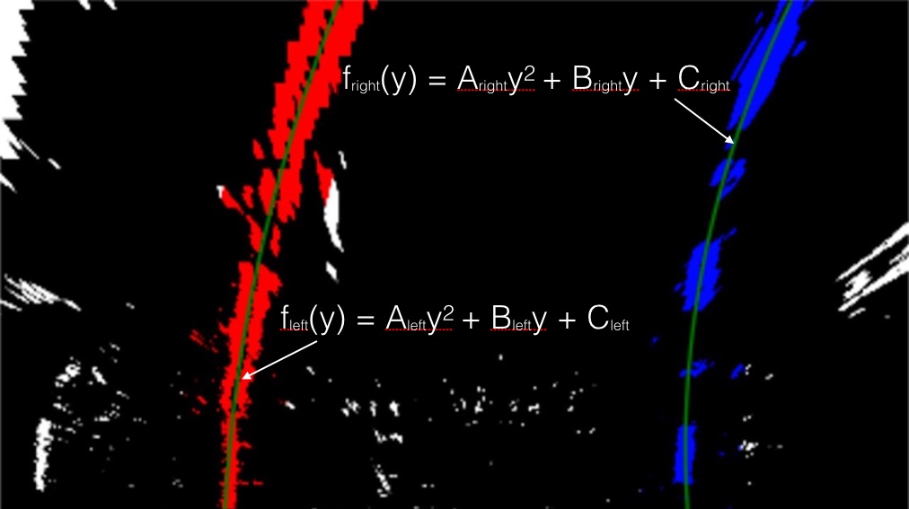
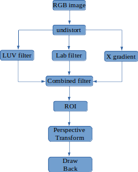

## Writeup Template

---

**Advanced Lane Finding Project**

The goals / steps of this project are the following:

* Compute the camera calibration matrix and distortion coefficients given a set of chessboard images.
* Apply a distortion correction to raw images.
* Use color transforms, gradients, etc., to create a thresholded binary image.
* Apply a perspective transform to rectify binary image ("birds-eye view").
* Detect lane pixels and fit to find the lane boundary.
* Determine the curvature of the lane and vehicle position with respect to center.
* Warp the detected lane boundaries back onto the original image.
* Output visual display of the lane boundaries and numerical estimation of lane curvature and vehicle position.

### 1. Camera Calibration

I start by preparing "object points", which will be the (x, y, z) coordinates of the chessboard corners in the world. Here I am assuming the chessboard is fixed on the (x, y) plane at z=0, such that the object points are the same for each calibration image.  Thus, `objp` is just a replicated array of coordinates, and `objpoints` will be appended with a copy of it every time I successfully detect all chessboard corners in a test image.  `imgpoints` will be appended with the (x, y) pixel position of each of the corners in the image plane with each successful chessboard detection.  


I then used the output `objpoints` and `imgpoints` to compute the camera calibration and distortion coefficients using the `cv2.calibrateCamera()` function.  I applied this distortion correction to the test image using the `cv2.undistort()` function and obtained this result:


### 2. Apply a distortion correction to raw images

read in images in test_images folder, using the function cv2.undistort(img, mtx, dist, None, mtx) to undistort each image, then write to output_images folder. 


```python
# undistort test image and write to output_images folder
if not os.path.exists('output_images'):
    output_path = 'output_images'
    for img_name in glob.glob('test_images/*.jpg'):
        img = cv2.imread(img_name)
        undist = cv2.undistort(img, mtx, dist, None, mtx)
        cv2.imwrite(output_path+'/'+img_name.split('/')[1],undist)
```



### 3. Use color transforms, gradients, etc., to create a thresholded binary image.

Use LUV color space L channel with lower and upper thresholds 200 & 255 respectively to pick out the white lines    
Use Lab color space b channel with lower and upper thresholds 155 & 200 respectively to select the yellow lines     
sobelx gradient thresholds between 70 & 210 detect vertical lines, if lower value < 70, may detect wrong lines among the lane         
combine LUV, Lab, sobelx method to filter out lane lines pixels



### 4. Apply ROI to binary image

The top part of image include sky, the left and right side of image is not related to lane lines.       
I only choose bottom and center part of region as the following:

vertices = np.array([[(0.4*w-50,h*0.7),(0.6*w+50,h*0.7),(w*0.85+100, h),
                                (w*0.15-100,h)]],dtype=np.int32)
                                


### 5. Apply a perspective transform to rectify binary image ("birds-eye view").

select 4 source points
h stand for image height, w stand for image width
src = [[w*0.4+5,h*0.7],[w*0.6,h*0.7],[w*0.85+10, h],[w*0.15+10, h]]
dst = [[w*0.15,0],[w*0.85,0],[w*0.85, h],[w*0.15, h]]

    # use src, dst points to compute M
    M = cv2.getPerspectiveTransform(src_pts, dst_pts)
    # Warp an image using the perspective transform, M
    warped = cv2.warpPerspective(img, M, (w,h), flags=cv2.INTER_LINEAR)



### 6. Detect lane pixels and fit to find the lane boundary.

1. First use sliding window method to find left and right lane line pixels
    - get left line base, right line base by histogram algorithm.
    
    histogram = np.sum(binary_warped[binary_warped.shape[0]//2:,:], axis=0)
    #Find the peak of the left and right halves of the histogram
    #These will be the starting point for the left and right lines
    midpoint = np.int(histogram.shape[0]//2)
    leftx_base = np.argmax(histogram[:midpoint])
    rightx_base = np.argmax(histogram[midpoint:]) + midpoint
    
    - sliding window HYPERPARAMETERS
    #Choose the number of sliding windows
    nwindows = 9
    #Set the width of the windows +/- margin
    margin = 100
    #Set minimum number of pixels found to recenter window
    minpix = 50
    #Set shift of the windows when the curve lane run out of window margin
    shift = round(1.5 * margin)
    
    - Loop through each window in nwindows
        1. Find the boundaries of our current window. This is based on a combination of the current window's                  starting point (leftx_current and rightx_current), as well as the margin I set in the hyperparameters.
        2. Then check the boundaries of our window, find out which activated pixels from nonzeroy and                         nonzerox above actually fall into the window.
        3. if not found valid pixels in step2, left shift window by 1.5 margin, right shift window by 1.5 margin,              search valid pixels. if finally no valid pixels, discard current frame lines, reuse previous detected              left and right lines.
        4. Append valid pixels indicies to our lists left_lane_inds and right_lane_inds in each window.
        5. get left line and right line pixels from nonzeroy and nonzerox of image if left_lane_inds and                       right_lane_inds not empty.

The result as below:


### 7. Determine the curvature of the lane and vehicle position with respect to center.



$ f(y) = A y ^ 2 + B y + C $       
$ f'(y) = \frac{dx}{dy} = 2Ay +B $         
$ f"(y) = \frac{d^2x}{dy^2} = 2A $        
$R_{curve} = \frac{(1 + (2Ay+B)^2)^{3/2}}{\mid2A\mid}$

Apply the above formula to calculate the left and right line curvature

### 8. Warp the detected lane boundaries back onto the original image.

#Recast the x and y points into usable format for cv2.fillPoly()            
pts_left = np.array([np.transpose(np.vstack([left_fitx, ploty]))])           
pts_right = np.array([np.flipud(np.transpose(np.vstack([right_fitx, ploty])))])               
pts = np.hstack((pts_left, pts_right))

#Draw the lane onto the warped blank image        
cv2.fillPoly(color_warp, np.int_([pts]), (0,255, 0))       
#compute inverse M transformation martix      
Minv = cv2.getPerspectiveTransform(dst, src)       
#Warp the blank back to original image space using inverse perspective matrix (Minv)        
newwarp = cv2.warpPerspective(color_warp, Minv, (img.shape[1], img.shape[0])) 

### 9. Pipeline:

image process as the following:


### 10. Conclusion

1. try the image process pipeline in project_video.mp4. the lane lines are straight,the result can meet expectation.
2. if try the pipeline in challenge_video.mp4. the lane lines keep straight, but there are shadows and light changes greatly. and there are other noise between the lane lines, for example, white rhombic shape, color diffrence in road which affect color or gradient detector algorithom. I add lane line validity check in each frame, if meet the requirement, update the lane lines to best_fit queue(with size of 5). then smooth 5 best_fit coefficient,generate left,right lines, draw back to undistorted image.
3. try the improved pipeline in harder_challenge_video.mp4. it can't detect S-bend curved lane lines well. need to consider further improvement in pixels detection and outlier check.
